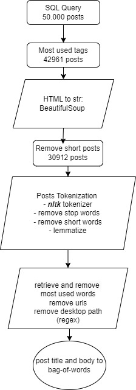
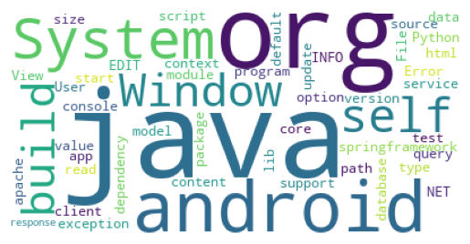

# Stack Overflow Tag Suggestion 📚

Welcome to the repository for my **Topic Modelling: Tag Suggestion** project! The goal of this project is to find related tags (topics) associated with forum posts and covers related NLP processing.

## Project Overview 📊

In this project, I explore techniques for suggesting related tags to forum posts. The repository contains the following components:

- **Data Preprocessing Notebook**: This notebook covers data retrieval, cleaning, and preprocessing to prepare the data for analysis.
- **Unsupervised Approach**: An exploration of unsupervised techniques including Latent Semantic Analysis (LSA), Latent Dirichlet Allocation (LDA), and K-means clustering.
- **Supervised Approach**: A comparison of different models, including neural networks (NN), with various prior embeddings (Word2Vec, USE, BERT).

## Preprocessing visualization 
Preprocessing pipeline : 

Stack Overflow corpus tokens : 

